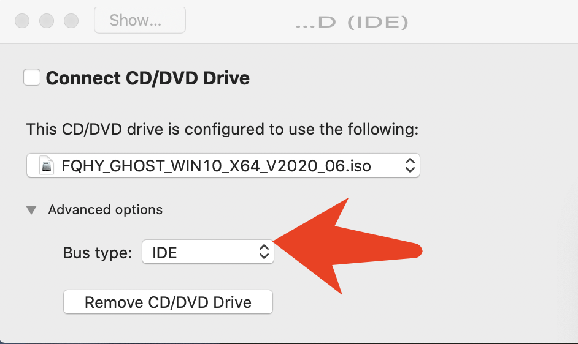

# Mac电脑安装与使用遇到的问题
## 1.虚拟机安装出现黑屏(Vware Fusion)
	安全与隐私》投屏中没有Fusion
	需执行如下命令：
	tccutil reset All com.vmware.fusion
	sudo sqlite3 "/Library/Application Support/com.apple.TCC/TCC.db" 'insert into access values ("kTCCServiceScreenCapture", "com.vmware.fusion", 0, 1, 1, "", "", "", "UNUSED", "", 0,1565595574)'
	sudo sqlite3 "/Library/Application Support/com.apple.TCC/TCC.db" 'insert into access values ("kTCCServiceListenEvent", "com.vmware.fusion", 0, 1, 1, "", "", "", "UNUSED", "", 0,1565595574)'
	sudo sqlite3 "/Library/Application Support/com.apple.TCC/TCC.db" 'insert into access values ("kTCCServicePostEvent", "com.vmware.fusion", 0, 1, 1, "", "", "", "UNUSED", "", 0,1565595574)'

## 2.安装winowds镜像文件时
	需在CD中修改为IDE
