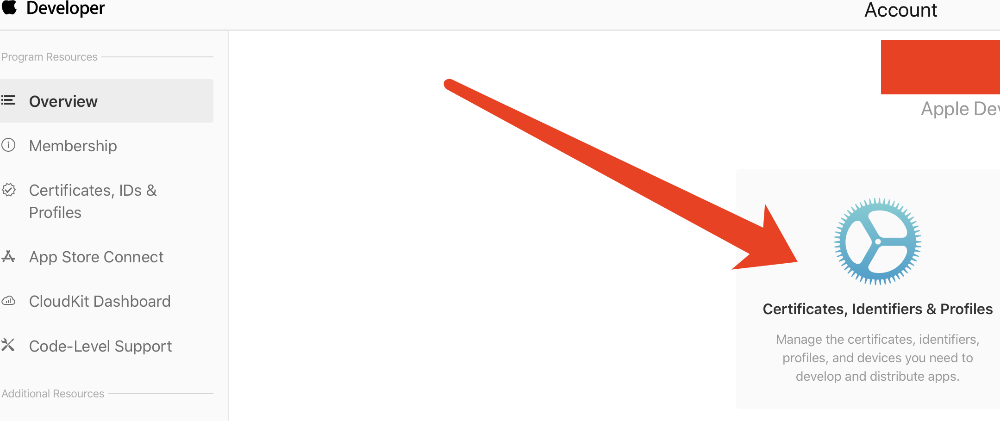
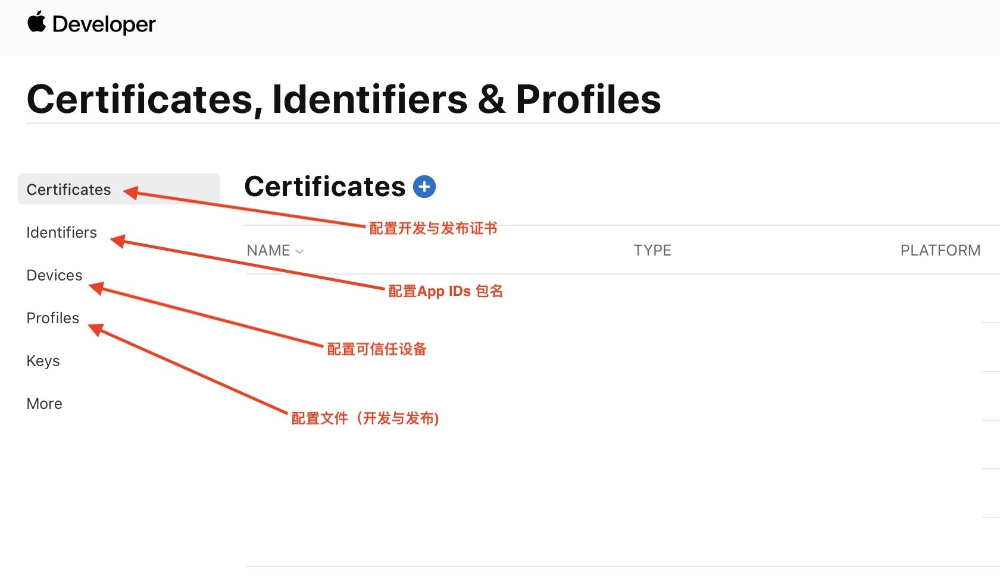
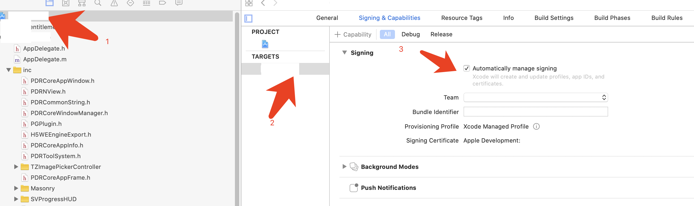
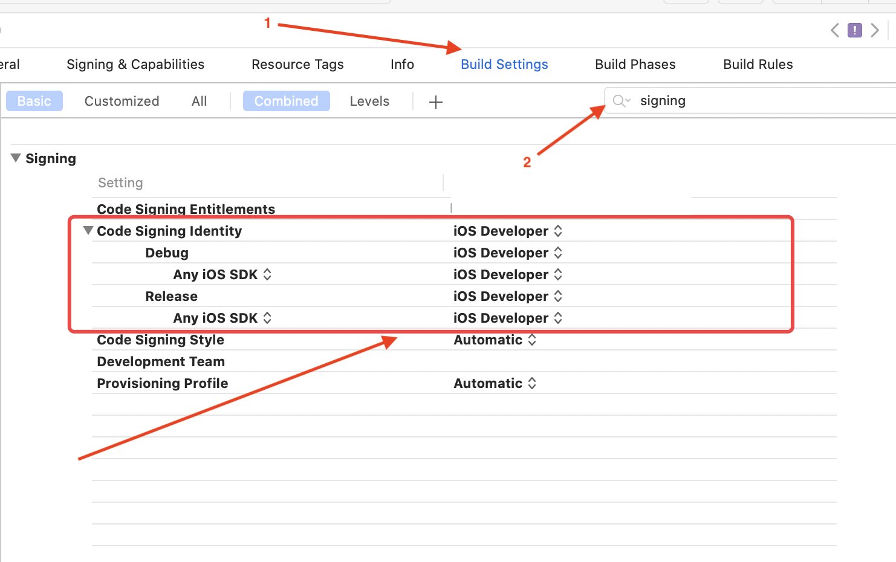

# iOS开发知识收集与问题
## App开发与发布的证书详情说明
	1.Certification(证书)
	证书是开发资格的认证，每个iOS开发者帐号有一套，分为两种：
	
	(1)Developer Certification(开发证书)
	安装在电脑上提供权限：开发人员通过设备进行真机测试。
	可以生成副本供多台电脑安装；
	
	（2)Distribution Certification(发布证书)
	安装在电脑上提供发布iOS程序的权限：开发人员可以制做测试版和发布版的程序。
	不可生成副本，仅有配置该证书的电脑才可使用;
	
	2.Provisioning Profile(授权文件)
	授权文件是对设备如iPod Touch、iPad、iPhone的授权，文件内记录的是设备的UDID和程序的AppId，即被授权的设备可以安装或调试Bundle identifier与授权文件中记录的App Id对应的程序。
	开发者帐号在创建授权文件时候会选择AppId，（开发者帐号下AppId中添加，单选）和UDID（开发者帐号下Devices中添加最多100个，多选）。
	授权文件分为两种，对应相应的证书使用：
	
	(1)    Developer Provisioning Profile(开发授权文件)
	在装有开发证书或副本的电脑上使用，开发人员选择该授权文件通过电脑将程序安装到授权文件记录的设备中，即可进行真机测试。
	注意：确保电脑有权限真机调试，即安装了开发证书或副本；在开发工具中程序的Bundle identifier和选中使用的授权文件的AppId要一致；连接调试的设备的UDID在选中的授权文件中有记录。
	
	(2)    Distribution Provisioning Profile(发布授权文件)
	在装有发布证书的电脑上（即配置证书的电脑，只有一台）制做测试版和发布版的程序。
	发布版就是发布到App Store上的程序文件，开发者帐号创建授权文件时选择store选项，选择App Id，无需选择UDID；
	测试版就是在发布之前交给测试人员可同步到设备上的程序文件，开发者帐号创建授权文件时选择AdHoc，选择App Id和UDID；只有选中的UDID对应的设备才可能安装上通过该授权文件制做的程序.
	
	3. Keychain(开发密钥)
	安装证书成功的情况下证书下都会生成Keychain，上面提到的证书副本就是通过配置证书的电脑导出Keychain（就是.p12文件）安装到其他机子 上，让其他机子得到证书对应的权限。Developer Certification就可以制做副本Keychain分发到其他电脑上安装，使其可以进行真机测试。
	注意：Distribution Certification只有配置证书的电脑才可使用，因此即使导出导出Keychain安装到其他电脑上，其他电脑也不可能具有证书的权限。
	4、App IDs
	App IDs 是每个应用的独立标识，在设置中可以配置该应用的权限。
	
	5、开发者证书
	开发证书类型分为两种，一种开发证书（iOS Development）一种发布证书(iOS Distribution)。开发证书（iOS Development）用于真机调试；生产证书用于打包上传App Store，用于验证开发者身份。
	
	6、推送证书
	如果项目中集成了推送功能，同样需要配置推送证书。推送证书同样也分两种：开发（Apple Development iOS Push Services）、生产（Apple Production iOS Push Services）。推送证书在AppID中创建生成，同时生成的的p12文件需要上传到服务端后台（友盟后台、极光后台或自己服务端后台）。
	
	7.配置文件（Provisioning Profiles）
	配置文件同样也分两种，分为开发（Development）和发布（Distribution），配置文件（Provisioning Profiles）中包含了证书、App ID、设备（Devices）。它在开发者账号体系中扮演着配置和验证的角色，是真机调试和打包上架必须的文件。
	ps:打Ad-hoc包的时候，如果遇到刚添加的设备UDID没添加进去，可以将开发模式的配置文件下载下来，打包后直接选中即可。
	
	8.申请开发者账号
	个人账号和公司账号类似，每年都需要支付99刀，其中公司账号需要邓白氏编码而个人账号并不需要。
	如果项目需要不通过App Store进行安装，可以申请企业账号。当然了，也可以找一些第三方直接打企业包，比如蒲公英之类的。

## 创建CSR证书
	CSR文件是通过Mac的钥匙串生成的，是创建开发证书必须的。方法：打开钥匙串，【钥匙串访问】->【证书助理】->【从证书颁发机构请求证书】，填入“电子邮件地址”和“常用名称”，选择“存储到磁盘”，点击继续。之后我们会得到一个CSR文件：CertificateSigningRequest.certSigningRequest。
	注意：在生成CSR文件的同时，会生成一对秘钥：公钥和私钥，私钥被保存到钥匙串中(可在钥匙串中查看)，公钥被包含在CSR文件中用于创建证书。

## 创建CSR证书签名请求文件，在keychain tool里，Request a certificate时，出错''The specified item could not be found in the keychain"
	解决办法：重启 keychain tool, 或 then 在keychain tool里，不要选择"keys" item，应该选择"all items"。

## 创建证书
[使用开发者账号登录苹果开发者网站](https://developer.apple.com/)

	(1)创建AppID。
	AppID也就是App的BundleID，用于唯一标示你的App。可通过"Identifiers"栏目创建，例如com.example.myApp。这里要说一句，如果不使用推送功能，可创建形如com.example.*的AppID；但如果要使用推送功能，就必须使用具体的AppID。创建AppID的时候可同时勾选推送服务，然后创建推送证书。
	
	(2)添加Device。
	将你iPhone的UUID添加到开发账号中去，这样你的iPhone就可以用于调试。不在开发账号中的设备无法参与调试。可通过"Devices"栏目添加。
	
	(3)生成证书。
	在"Certificates"栏目下创建证书，选择"iOS App Development"，之后按要求上传CSR文件即可生成开发证书。

	(4)创建Provisioning Profile(即PP文件)。
	进入"Profiles"栏目，选择"iOS App Development"，之后选择要加入到PP文件中的AppID，然后选择加入到PP文件中的证书，最后选择加入到PP文件中的设备。
	注意：PP文件可以看成是一个"数据包“，不同类型的PP文件包含不同的内容：
	​ Development PP = AppID + DevelopmentCertS(可包含多个) + Devices
	​ Distribution PP = AppID +DistributionCert
	​ AdHoc PP = AppID + DistributionCert + Devices

## 证书本地配置
	将上述创建的证书(若有推送证书也需要一起下载下来)和PP文件下载到本地。双击安装证书会将证书添加到钥匙串中，并自动与之前创建的私钥关联起来。双击PP文件会将其添加到Xcode中，在真机调试时，Xcode会根据PP文件去钥匙串中访问相应的证书和私钥，并验证连接的设备是否已经包含在PP文件的设备清单中.

## P12文件
	如果有多台Mac的开发需求，会想到在每台Mac上都重复以上的步骤来创建证书和配置环境。但是Apple对一个开发账号下创建的证书个数进行了限制，在创建多个证书之后就无法继续创建了。事实上，Mac开发过程中最重要的是创建CSR文件时生成的私钥，可通过从钥匙串中将证书(包含私钥)导出为P12文件来解决多台Mac开发的问题。
	打开钥匙串，找到对应的证书，展开证书项会发现其关联了私钥。右键导出为P12文件。未关联私钥的证书是无法导出P12文件的。
	将该P12文件和PP文件分发到其他用于开发的Mac上面，然后安装即可

## Xcode配置iOS证书信息
	选择工程名 》 右侧Tagets 》Signing & Capabilites 》Signing设置自动配置证书

	设置证书Build Setting 》Signing

	