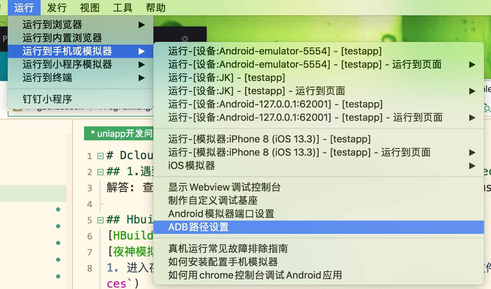
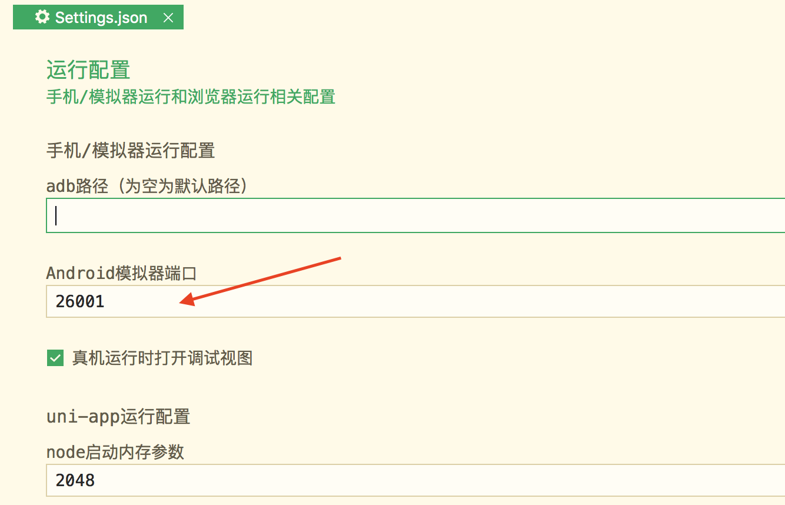

# Dcloud前端用HBuilderXIDE用uni-app框架开发app
## 1.遇到一个报 [错误] ERR: ./pages/xxxx.vue(405:6): unexpected `{` ?
解答: 查找发现是sytle中用scss编译报错 如下格式报错：-webkit-/-ms-等前缀

## HbuildX连接到 夜神模拟器 上运行
[HBuilder](https://www.dcloud.io/hbuilderx.html)
[夜神模拟器](https://www.yeshen.com/)
1. 进入夜神模拟器安装目录（找到bin或MacOS）nox_adb(或adb)执行文件（windows电脑执行`nox_adb connect 127.0.0.1:62001`或苹果电脑需授权`sudo adb connect 127.0.0.1:62001`）（执行查看`nox_adb devices`或`adb devices`)

2. 进入HubildX安装目录下（HBuilderX/plugins/launcher/tools/adbs）执行 `adb connect 127.0.0.1:62001`

3. 设置adb端口

